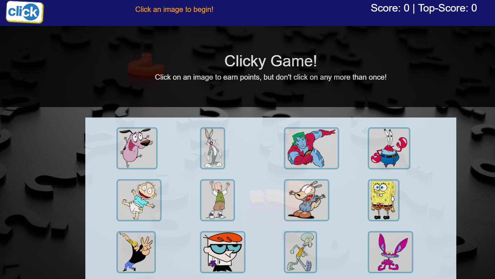
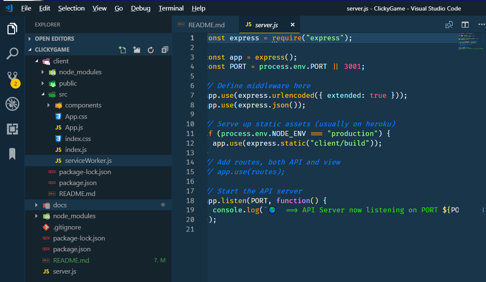

# Clicky Game

_By Armando Pensado_

## Description

The application is a memory game using NodeJS, Express, and React. The application falls into the definition of a single page application, and was built using several components. 

The general idea about the game, is that the application present twelve cards and the user need to start selecting them, remembering what was selected before.  To win the game the user must select all card only one time. Selecting a card twice, the game is lost.



## How does it work

The application will present the cards once is loaded. Every time the user selects a card, the application will shuffle them, changing positions. As the user selects more cards, it will be harder to remember what card has been selected already.

For each card selected once, the application will increase the score by one point and it will keep track of the top-score, if the user plays the game more than once.

The user just needs to click a card to get the game started. There will be messages at the top as the game progresses. If all twelve cards as selected once, the user will se a “YOU WIN!” message on the top.

## Who can benefit from this application

This application is a good example for NodeJS, Express, and React developers. It provides a programming structure very close to a _MERN_. The only thing missing is the database.

The program shows how to break the application into components that are used in the main page via the **“client/src/App.js”** file.

The application uses bootstrap 4 and demonstrates how to apply CSS styles to the application as a whole and the individual components.


## How developers can get started

To start, the developer must have NodeJS installed in the computer. After, that the project can be cloned and initialized.  Here are the steps for getting started.

1. Install NodeJS into the computer  (https://nodejs.org/en/). Download button and run through the installation file.

2. Clone, download, or Fork the project into the computer.

3. Bring all external module dependencies using the command:

```js
npm i
```

After, the initialization, and using Microsoft Visual Code, the project folder should resemble as depicted below, and should be ready for execution.



Once the code is ready, starting the application can be done by executing the following command.

```js
npm start
```

## Who maintains and contributes to the project

This is a personal project fro my own learing experience. 

## Where users can get help with the project

The developer can refer to the following links:

* NodeJs  : https://nodejs.org/en/
* Express : https://www.npmjs.com/package/express
* React  : https://reactjs.org/
* Create React App" : https://github.com/facebook/create-react-app
